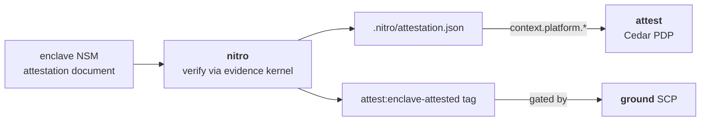

# nitro

**Runtime/enclave attestation producer for AWS Secure Research Environments.**

Part of the [Provabl](https://provabl.dev) suite:
- **[ground](https://ground.provabl.dev)** — deploy correct AWS foundations
- **[attest](https://attest.provabl.dev)** — compile, enforce, and prove compliance
- **[qualify](https://qualify.provabl.dev)** — train and qualify researchers
- **[vet](https://vet.provabl.dev)** — verify the software supply chain
- **nitro** — attest the runtime: prove the enclave is in a known-good state ← you are here

> Ground your infrastructure, attest your controls, qualify your people, vet your software, steward your data.

---

## What nitro does

`nitro` is the **producer** for the evidence kernel's runtime-attestation pair. It verifies an
AWS Nitro Enclave attestation document and turns the verdict into the durable outputs the rest of
the suite consumes:



`attest:enclave-attested` is the enclave-integrity attestation tag — distinct from `tpm`'s
`attest:boot-attested` (measured-OS boot). They prove different properties at different trust
strengths and are deliberately not conflated (provabl ADR 0003).

It runs the [`provabl/evidence`](https://github.com/provabl/evidence) nitro provider in-process:
the appraiser binds the challenge nonce natively, verifies the COSE_Sign1 signature, and checks
the PCR policy; nitro supplies the real `Source` (the document) and `Verifier` (COSE/CBOR decode +
X.509 chain to the AWS Nitro root) that the stdlib-only kernel leaves injected.

## Core concepts

(terms link to the suite [glossary](https://github.com/provabl/provabl/blob/main/docs/guide/glossary.md))

- **[Enclave](https://github.com/provabl/provabl/blob/main/docs/guide/glossary.md#enclave)** — a hardware-isolated execution environment; an AWS Nitro Enclave can emit a signed attestation *document* proving what's running inside.
- **[PCR](https://github.com/provabl/provabl/blob/main/docs/guide/glossary.md#pcr-platform-configuration-register)** — tamper-resistant measurement registers in the document; the appraiser checks them against an expected/[golden](https://github.com/provabl/provabl/blob/main/docs/guide/glossary.md#golden-pcr) value.
- **[Freshness / nonce](https://github.com/provabl/provabl/blob/main/docs/guide/glossary.md#freshness--nonce)** — a live `--device` read binds *this run's* challenge, so the document can't be replayed; a captured `--doc` is verifiable but not fresh.
- **[Lowered attribute](https://github.com/provabl/provabl/blob/main/docs/guide/glossary.md#lowered-attribute)** — nitro's verdict becomes `.nitro/attestation.json` (→ `context.platform.*`) + the `attest:enclave-attested` tag attest/ground gate on.

## Verification: the real path

The attestation document is CBOR-encoded and COSE_Sign1-signed (ES384). nitro:

1. decodes the COSE_Sign1 / CBOR object,
2. verifies the certificate chain (`cabundle`) anchors to the **AWS Nitro Attestation PKI root**
   (embedded; SHA256 `64:1A:03:21:…:5B`, `CN=aws.nitro-enclaves`),
3. verifies the document signature against the leaf certificate,
4. hands the parsed `module_id` / nonce / PCRs to the kernel appraiser, which binds the nonce and
   applies the PCR policy.

## Trust model — read this

What nitro's `attest:enclave-attested` verdict actually rests on, and where it stops:

- **Trust anchor: the embedded AWS Nitro Attestation PKI root.** nitro verifies the document's X.509
  chain to a root CA compiled into the binary. The guarantee is only as strong as that root being the
  genuine AWS one and the binary not being tampered with — verify your build (cosign / SLSA provenance).
- **Freshness is real only on `--device`.** The live `/dev/nsm` read binds *this run's* nonce, so the
  document can't be replayed (`nonce_verified=true`). A captured `--doc` minted for a different
  challenge verifies its signature and PCRs but reports `nonce_verified=false` — it proves the enclave
  existed, not that it's live *now*.
- **`attest:enclave-attested` ≠ `attest:boot-attested`.** nitro proves *running inside a verified Nitro
  Enclave*; it says nothing about an ordinary instance's OS boot (that's tpm's measured-boot tag).
  They are deliberately distinct trust strengths (provabl ADR 0003).
- **The golden PCRs are captured from a trusted reference boot — not computed from the AMI.** Enclave
  PCRs cannot be derived offline from an image's contents; they only exist once an enclave has booted and
  measured itself. So `--expected-from-ami`'s `attest:pcr*` tags are ground-truth values recorded by a
  trusted vetter run: [`vet ami-reference`](https://github.com/provabl/vet) launches the AMI on a
  known-good instance, boots it, reads the measured PCRs from the attestation output, and locks them as
  AMI tags. The binding is therefore only as strong as (a) that reference boot genuinely being known-good
  and (b) the tags staying locked to the vetter principal (ground's lockdown SCP) so a running instance
  cannot rewrite its own golden reference.
- **The `/dev/nsm` device path is enclave-only and CI-uncovered.** It compiles behind the `nsm` build
  tag and can only run inside a real enclave, so CI compile-checks it but cannot exercise it.

## Install

```bash
go install github.com/provabl/nitro/cmd/nitro@latest   # requires Go 1.26.4+
# or, from a clone:
make build                                             # → bin/nitro
make build-nsm                                         # compile the enclave-only /dev/nsm source (-tags nsm)
```

**Prerequisites.** Go 1.26.4+. The `--doc`/`--device` verification path needs no AWS access; tagging a
role (`--role-arn`) needs `iam:TagRole` (run `nitro preflight` to check). The live `--device` read runs
**only inside a Nitro enclave** and requires the `nsm`-tagged binary (`make build-nsm`).

## Usage

```bash
# Verify a captured attestation document and write .nitro/attestation.json
nitro attest --doc attestation.bin

# Also tag a principal's role when attested (gated by ground's nitro SCP)
nitro attest --doc attestation.bin --role-arn arn:aws:iam::123456789012:role/Workload --region us-east-1

# Require specific enclave measurements
nitro attest --doc attestation.bin --expected-pcr0 7fb5c5…

# Inside a Nitro enclave: read a fresh document straight from /dev/nsm
nitro attest --device --expected-pcr0 7fb5c5…

# Bind to the vetted image: auto-load the golden PCRs from this instance's source-AMI attest:pcr* tags
# (the ones `vet ami-reference` recorded; reads IMDS + ec2:DescribeImages on the instance)
nitro attest --device --expected-from-ami
```

## Document sources

| Source | When | Freshness |
|---|---|---|
| `--doc <file>` | a document captured from an enclave, or AWS's public sample | live doc → `nonce_verified=true`; a sample minted for a different challenge → `nonce_verified=false` (correct: not fresh) |
| `--device` (`/dev/nsm`) | running **inside** a Nitro enclave | always fresh — the read embeds this run's challenge nonce |

The `/dev/nsm` device source is compiled only under the `nsm` build tag (`make build-nsm`) and runs
**only inside an enclave**. CI compile-checks it; the ioctl itself was validated on real Nitro
hardware (m5.xlarge, us-west-2) and a captured document is vendored as
`internal/nsm/testdata/real-attestation.bin` to pin the parse path offline.

## Development

```bash
make check       # gofmt + go vet + go test (the device read is excluded)
make build       # build bin/nitro
make build-nsm   # compile-check the enclave-only /dev/nsm source
```

## License

Apache 2.0. Copyright 2026 Playground Logic LLC.
